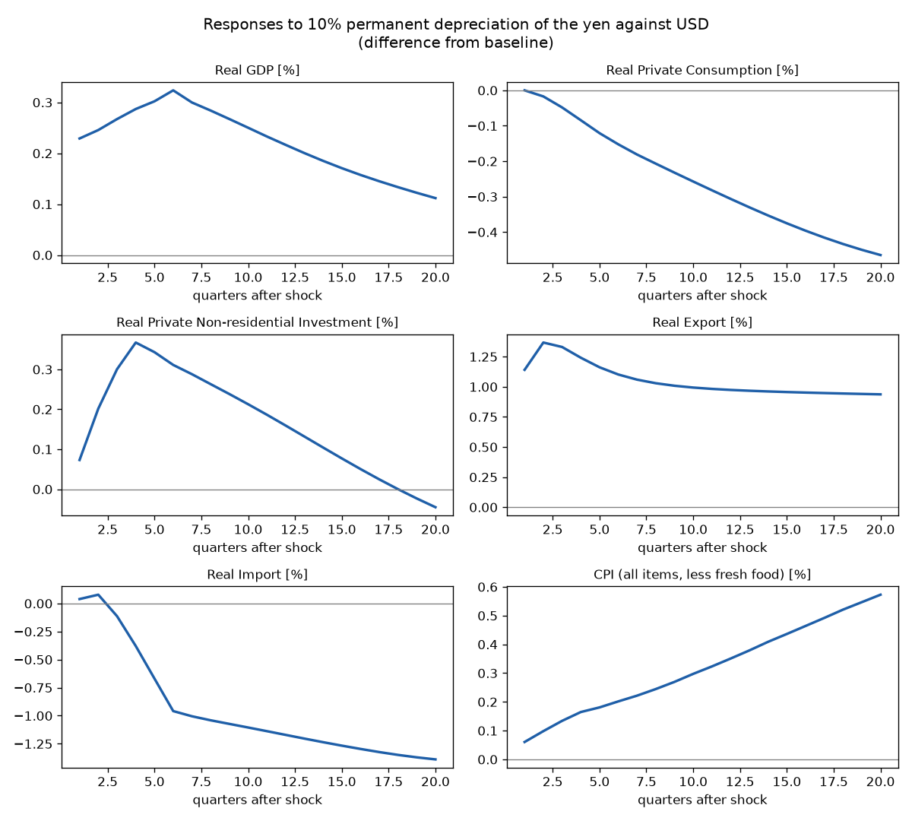
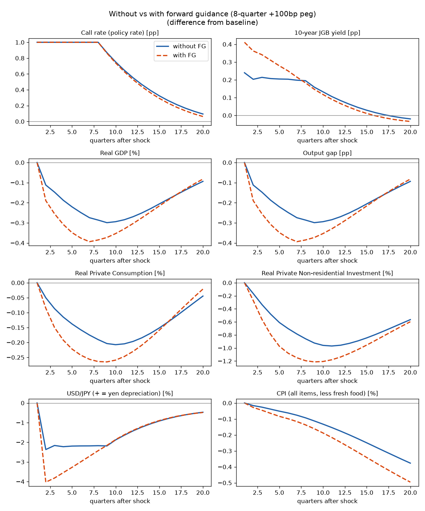
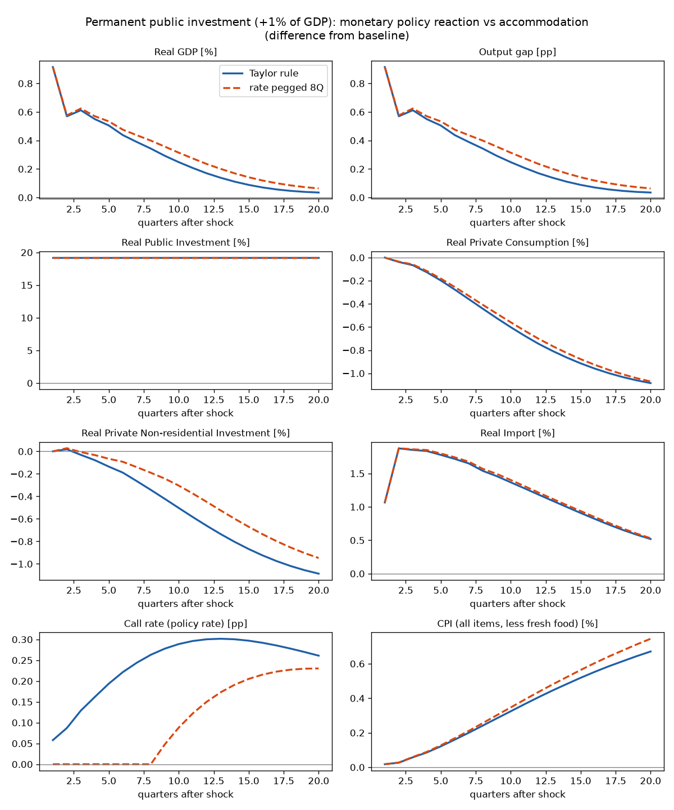
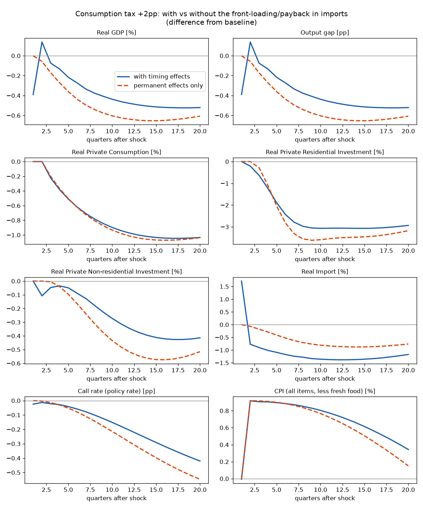

# qjem-python

日本銀行の大規模マクロ経済モデル **Q-JEM（2019年版）** を、EViews なしで **Python だけ**で解くための非公式実装です。

*An unofficial pure-Python solver for the Bank of Japan's Quarterly Japanese Economic Model (Q-JEM, 2019 version). It reads the BOJ's official EViews replication files and reproduces Figures 6–9 of the working paper without EViews.*

> **注意**：本リポジトリは日本銀行および論文著者とは無関係の個人による実装です。シミュレーション結果は日本銀行の公式見解を示すものではありません。

## 出典

Hirakata, N., Kan, K., Kanafuji, A., Kido, Y., Kishaba, Y., Murakoshi, T., and Shinohara, T. (2019).
"The Quarterly Japanese Economic Model (Q-JEM): 2019 version."
*Bank of Japan Working Paper Series*, No.19-E-7.
https://www.boj.or.jp/en/research/wps_rev/wps_2019/wp19e07.htm

モデルの式、係数、ベースラインデータ、論文、モデル資料の著作権は日本銀行と著者に帰属します。これらは**本リポジトリに含まれておらず**、初回実行時に日本銀行のウェブサイトから公式の replication files（`wp19e07.zip`）を自動でダウンロードして使います。

## 使い方

```bash
pip install -r requirements.txt
python run_simulations.py
```

初回実行時に `data/wp19e07/` へ日銀の配布物が展開されます。7本のシミュレーションは合計10秒程度で終わり、結果は `output/` に出力されます。

- `output/SimN.png`：各シナリオの図
- `output/Sim6_vs_Sim7.png`：フォワードガイダンスの有無の比較
- `output/Sim8_vs_Sim9.png`、`output/Sim8_vs_Sim10.png`：財政シナリオの比較
- `output/responses.csv`：ベースラインからの乖離（水準の変数は%、金利とGAPは%ポイント）
- `output/fiscal_multipliers.csv`：公共投資ショックの実質GDP乗数（各期・累積）
- `output/tax_revenue.csv`：消費税シナリオの税収（名目GDP比、%ポイント）と実質GDP

## シミュレーション

| | シナリオ | 論文との対応 |
|---|---|---|
| Sim1 | 海外GDP +1%（恒久的） | Figure 6（Figure 10 の Q-JEM の線） |
| Sim2 | 原油価格 −10%（恒久的） | Figure 7 |
| Sim3 | Sim1 と Sim2 の同時発生 | Figure 8 |
| Sim4 | ドル円 10% 円安（恒久的） | Figure 9 |
| Sim5 | 政策金利ショック +100bp（1期のみ、以後テイラー・ルール） | 論文になし |
| Sim6 | コールレートを8四半期 +100bp に固定し、その後ルールに戻す | 論文になし |
| Sim7 | Sim6 に、信頼されたフォワードガイダンスを加えたもの | 論文になし |
| Sim8 | 公共投資を実質GDP比 +1% 恒久的に増やす（テイラー・ルール） | 論文になし |
| Sim9 | Sim8 と同じ財政拡張。ただしコールレートを8四半期ベースラインに据え置く | 論文になし |
| Sim10 | 公共投資 +GDP比1% を8四半期だけ（一時的な財政拡張） | 論文になし |
| Sim11 | 消費税 +2%pt 増税（2期目に実施、駆け込み・反動込み） | 論文になし |
| Sim12 | 消費税 −2%pt 減税（2期目に実施、駆け込み・反動込み） | 論文になし |
| Sim13 | 消費税 +2%pt 増税の恒久効果のみ（駆け込み・反動を除く） | 論文になし |

Sim1〜4 は、論文の図と6変数すべてで形・大きさが一致することを目視で確認しています（論文に数値表はありません）。また、ショックを与えずに解くとベースラインを相対誤差 1e-10 で再現します。



### フォワードガイダンス（Sim7）

Q-JEM の予想コールレート `ZCALL_V1`〜`ZCALL_V39` は、テイラー・ルールで先の金利を予想する後ろ向きの期待です。そのため、Sim6 のように金利を固定するだけでは「据え置きの約束」が期待に反映されません。Sim7 では、据え置き期間の k 期目に、残り 8−k 期分の予想金利を約束した水準に固定し（その期間の式を外し）、その先はモデル本来の予想式がつながるようにしています。

`forward_guidance_segments(8, 1.0)` の2番目の引数を小さくすると、部分的にしか信頼されないケースを表せます。



### 財政乗数（Sim8〜10）

公共投資 `IG` を外生に、ショック `V_IG` を内生に入れ替えて、実質公共投資をベースライン +実質GDP比1%（＝公共投資の水準で +19.2%）の経路に固定しています。実質GDP乗数 dY/dG は次のとおりです。

| | 1期 | 4期 | 8期 | 12期 | 20期 |
|---|---|---|---|---|---|
| Sim8 各期 | 0.91 | 0.55 | 0.34 | 0.17 | 0.04 |
| Sim8 累積 | 0.91 | 0.66 | 0.54 | 0.44 | 0.29 |
| Sim9 累積（金利据え置き） | 0.91 | 0.67 | 0.57 | 0.48 | 0.33 |
| Sim10 累積（8期で終了） | 0.91 | 0.66 | 0.54 | 0.38 | 0.19 |

初期の乗数は1弱で、その後は減衰します。公共投資は輸入含有率が高く初期から輸入が増えること（1期で +1.1%）、テイラー・ルールで政策金利が上がり民間消費・設備投資がクラウディングアウトされることが効いています。金利を8四半期据え置くと（Sim9）設備投資の落ち込みが小さくなり、20期の累積乗数は 0.29 → 0.33 に上がります。



### 消費税（Sim11〜13）

Q-JEM は消費税を専用の税率変数ではなくダミー変数で持っています。式の中の乗数が過去の引き上げ幅（%ポイント）そのもの（1989年と2014年が3、1997年が2）なので、ダミーをその乗数で割れば任意の税率変化に合わせられます。`consumption_tax_shocks()` はこれを使って各経路を Δτ にそろえています。

| ダミー | 入る式 | 効果 |
|---|---|---|
| `D142`（2014Q2）| `PCP`、`PIH`、`PIG` に `C_*(4)*3*D142` | 物価水準の押し上げ |
| `D142` | `IM` に `C_IM(8)*3*D142` | 増税後の輸入の反動減 |
| `D141`（2014Q1）| `IM` に `C_IM(7)*3*D141` | 増税前の輸入の駆け込み |
| `D892`（1989Q2）| `PCP`、`PIH`、`PIG` のみ | 同じ物価経路。1989年は輸入式に入っていないので駆け込み・反動を伴わない |
| `D151Z`（ステップ）| `SNAVAT/GDPN` に `C_SNAVAT(4)*D151Z` | 消費税収 |
| `VATCPIXFOR` 他 | `CPIXF`、`CPIXFENOR`、`CPIENOR` | 公表（税込み）CPI の税分 |

実物経済への波及は物価経由です。`PCP` が上がると `CPQ`（実質消費の均衡水準、`LOG(CPQ*(PCP/100)/(YDN-YP))` で定義）が下がり、`CP` が誤差修正で下がります。`PINV` と `PCG` は `DLOG(PCP)` をそのまま受けるので、設備投資・政府消費のデフレーターにも波及します。一方、テイラー・ルールが見る `PIX` は `CORE_CPIV`（**税抜き**）から作られるため、政策金利は消費税の直接効果には反応せず、需給ギャップの悪化を通じてのみ反応します。

推計値から得られる「消費税率1%ポイントあたり」の大きさは次のとおりです。

- 消費デフレーター：`C_PCP(4)` = **+0.46%**
- 消費税収：`C_SNAVAT` の各段差を引き上げ幅で割ると **名目GDP比 +0.52%ポイント**（1%ポイントあたり約2.8兆円という実績とも整合的）

+2%pt 増税（Sim13、恒久効果のみ）の結果は次のとおりです。

| | 4期 | 8期 | 12期 | 20期 |
|---|---|---|---|---|
| 実質GDP [%] | −0.27 | −0.54 | −0.64 | −0.61 |
| 実質民間消費 [%] | −0.37 | −0.81 | −1.02 | −1.04 |
| 実質住宅投資 [%] | −1.09 | −3.56 | −3.51 | −3.18 |
| コアCPI [%] | +0.91 | +0.84 | +0.68 | +0.15 |
| コールレート [%pt] | −0.03 | −0.14 | −0.29 | −0.55 |
| 消費税収 [名目GDP比 %pt] | +1.05 | +1.05 | +1.05 | +1.05 |

CPI の押し上げは税分（+0.92%）で始まりますが、需給ギャップの悪化で税抜き物価が下がるため、20期には +0.15% まで縮みます。テイラー・ルールはこれに反応して政策金利を −0.55%ポイント下げます。減税（Sim12）は増税（Sim11）とほぼ左右対称で、モデルがこの範囲で概ね線形であることを示しています。

**注意**：Q-JEM は輸入の駆け込み（`C_IM(7)`）を推計していますが、対応する在庫の積み増しがありません（`KIV` は実質GDPの伸びにのみ連動）。そのため Sim11 では増税前の四半期に輸入の急増がそのまま実質GDPのマイナス寄与（−0.39%）として現れ、消費や住宅投資の駆け込みは現れません。駆け込み・反動の扱いに関心がない場合は Sim13 を見てください。



## 実装

| ファイル | 内容 |
|---|---|
| `fetch_boj.py` | 日本銀行サイトから replication files を取得・展開 |
| `wf1reader.py` | EViews のワークファイル（`.wf1`）の読み込み（バイナリ形式を解析して実装） |
| `eviews_expr.py` | EViews の式を Python の残差関数に変換。`D`、`DLOG`、`@MOVAV`、`@MOVSUM` とラグはコンパイル時に時点ずらしとして展開 |
| `qjem.py` | 内生・外生の入れ替え、二部マッチングと Tarjan 法によるブロック分解、各期のニュートン法による求解 |
| `run_simulations.py` | 日銀の `calc_response_to_exogenous_shocks.prg` の移植と、金融政策シナリオの追加 |

EViews の `m.control`（目標とする軌道に合わせて外生のショックを逆算する機能）は、「目標とする変数を外生に、ショック `V_*` を内生に入れ替えて同時に解く」ことで置き換えています。871本の式は664ブロックに分解され、同時に解く必要があるのは最大128本のブロックです。

### 独自シナリオ

`run_simulations.py` の `SIMS` に追加します。

```python
"MySim": dict(
    title="...",
    shocks=[("POIL", "mul", 1.2, 1, 20)],          # (系列, 演算, 値, 開始期, 終了期)
    #  演算: "mul"=倍率, "add"=水準加算, "gdp%"=ベースライン実質GDP比 値% を加算
    segments=[(20, ["POIL"], ["V_POIL"])],          # (期数, 外生にする変数, 代わりに内生にする変数)
    plot=BOJ_VARS),
```

## データについて

日銀が配布する `BASECASE.wf1` のベースラインは**架空の定常状態**（0001Q1〜0010Q4 の40期）で、実際の時系列データではありません。公式統計が使われているのは係数の推計で、推計期間はおおむね1980年代〜2018年です（日銀配布の `qjem_html/qjemdoc.html` に式ごとの期間と変数ごとの出典が載っています）。

- 主な出典：内閣府「国民経済計算」、総務省「労働力調査」「消費者物価指数」、厚生労働省「毎月勤労統計」、日本銀行（コール市場関連統計、短観、資金循環統計）、財務省（国際収支統計、貿易統計、法人企業統計）、東京証券取引所、BIS、米国の BEA・BLS・CBO・FRB
- ゼロ金利制約はモデルに含まれていません（論文の脚注13）

## ライセンス

本リポジトリの Python コードは MIT License です（`LICENSE`、適用範囲は `NOTICE` を参照）。Q-JEM のモデル、係数、データ、論文、資料には適用されません。日本銀行の資料を商用目的で転載・複製する場合は、事前に日本銀行情報サービス局に相談する必要があります（日本銀行ワーキングペーパーシリーズの注記より）。
